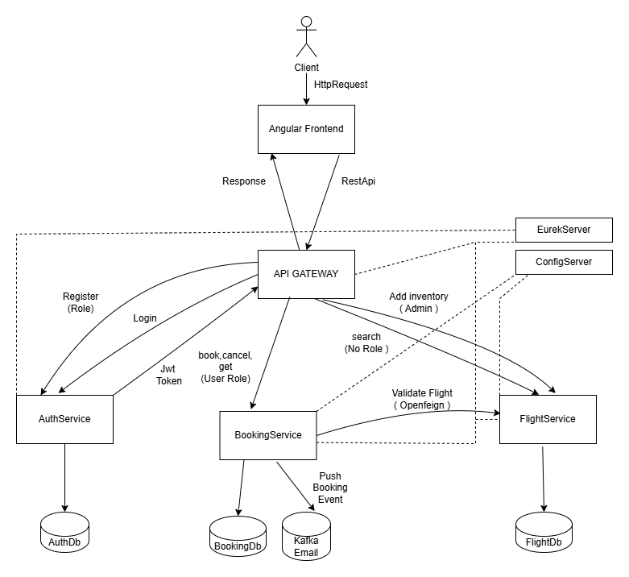
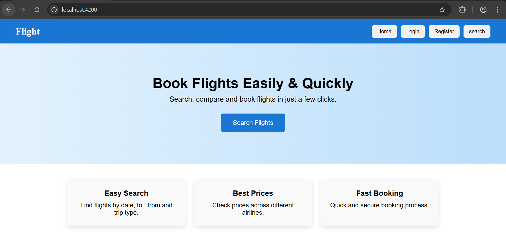
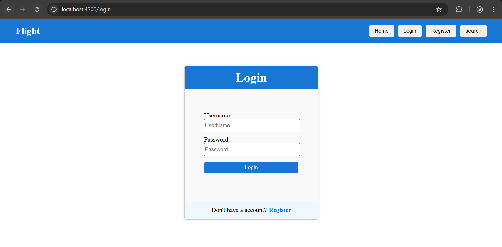
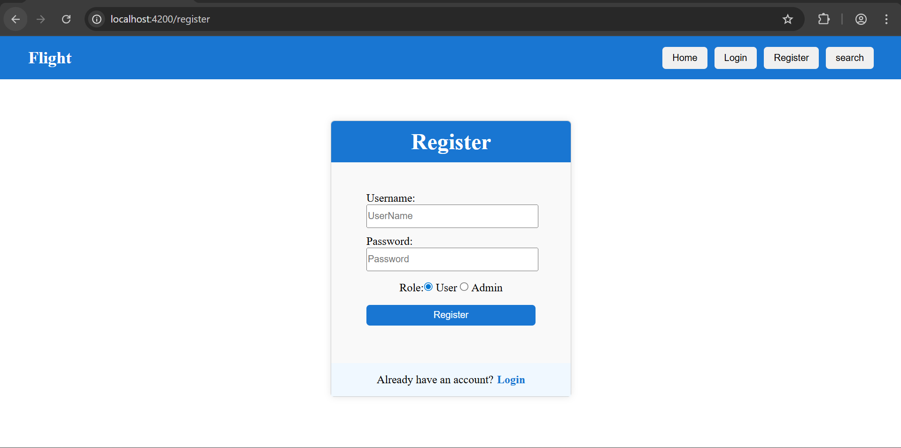

#  Flight Booking Application

A full-stack Flight Booking web application built using **Angular** (Frontend) and **Spring Boot Microservices** (Backend).  
Users can search flights, view availability, and securely log in to book flights.

---
# Overall Flow


##  Features

###  Authentication
- User Login & Registration
- JWT-based authentication
- Role-based access (User/Admin)
- Secure token storage

###  Flight Search
- Search flights by:
  - From & To location
  - Journey date
  - One-way / Round-trip
- Real-time flight availability
- Clean airline-style UI for results

###  Flight Results
- Airline name & flight number
- Departure & arrival time
- Price display
- Book button for next flow

###  UI/UX
- Reusable Navbar across all pages
- Form validation with red highlights
- Error & success messages
- Responsive layout

---

##  Tech Stack

### Frontend
- Angular (Standalone Components)
- Reactive Forms
- Angular Router
- RxJS
- CSS (Flexbox-based UI)

### Backend
- Spring Boot
- Spring Cloud (Gateway, Eureka)
- Spring Security (JWT)
- MongoDB
- REST APIs

---

##  Project Structure
```
flight-frontend/
├── src/
│   ├── app/
│   │   ├── components/
│   │   │   ├── home/
│   │   │   ├── login/
│   │   │   ├── register/
│   │   │   ├── search/
│   │   │   └── navbar/
│   │   ├── services/
│   │   │   ├── auth.ts
│   │   │   └── service.ts
│   │   ├── app.config.ts
│   │   ├── app.html
│   │   ├── app.css
│   │   ├── app.ts
│   │   └── app.route.ts
│   ├── index.html
│   ├── main.ts
│   └── styles.scss
├── angular.json
├── package.json
├── tsconfig.json
└── README.md
```


## Prerequisites
- Node.js (v18+)
- npm (v9+)
- Angular CLI (v21+)
- Backend API running on http://localhost:8088

# Home Page


# Search Flights


# Flight Results


# Login Page


# Registration Page



##  Frontend Validation Rules

All essential validations are implemented at the frontend level to ensure data integrity, prevent invalid submissions, and provide immediate user feedback.

###  Search Form Validations
- Source (From) field is mandatory
- Destination (To) field is mandatory
- Travel (Journey) date is required

###  Login Form Validations
- UserName field is mandatory
- Password field is mandatory

###  Registration Form Validations
- UserName field is mandatory
- Password field is mandatory
- Submit button remains disabled until the form is valid
